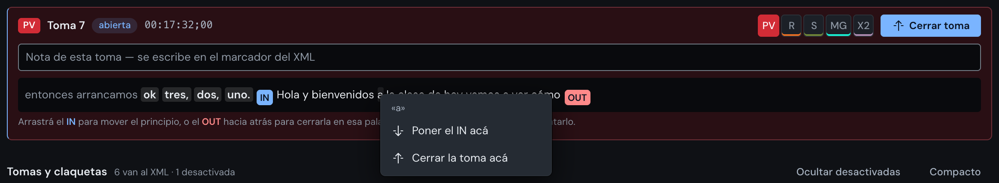
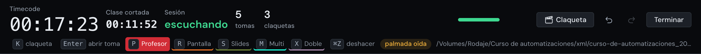
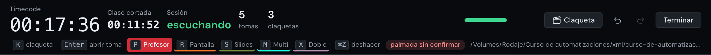

# Note Taker

App local de macOS (Apple Silicon) que toma las notas de rodaje **mientras la
clase se está grabando en vivo**, y devuelve un XML listo para importar en
**Premiere Pro** con el audio adentro.

El profesor dice "3, 2, 1" y la toma se abre; dice "Pausa" y se cierra; dice
"claqueta" o aplaude y queda una marca de sincronía. Al final hay **un solo
XML** con todas las tomas, todas las claquetas y el WAV de la clase en A1.

```
Zoom / interfaz ──► Note Taker ──► xml/clase.xml ──► Premiere
                       │
                       └─► xml/Audio/clase-1.wav
```

---

## El escenario

Una clase en vivo, grabada de corrido, de una a tres horas. El editor no está
en la sala: recibe los archivos después y tiene que armar el corte.

Lo que hace difícil ese trabajo no es cortar, es **saber dónde**. Una clase de
tres horas tiene treinta tomas, la mitad son intentos repetidos, y la única
persona que sabe cuál sirve es la que estaba mirando. Esta app es para esa
persona: toma las notas sin sacarle la vista de encima al profesor, y las deja
en el formato que el editor ya sabe abrir.

Y una cosa más, que es la que de verdad manda el diseño entero: **los tiempos
tienen que cerrar en el total**. Un marcador corrido tres segundos en el minuto
diez es un corte mal puesto; corrido tres segundos en la hora dos es una clase
que hay que volver a mirar entera. Por eso todo lo de acá se estampa contra el
audio grabado y no contra el reloj de pared (ver **Un solo reloj**).

## Cómo funciona

1. **Sesiones** — se elige la carpeta del curso. Adentro se crean `xml/` con el
   archivo que se importa en Premiere, `xml/Audio/` con el WAV y `xml/Datos/`
   con lo que la app se guarda para sí misma.
2. **Preparar** — una lista de verificación: la entrada de audio con su
   medidor, Whisper, la carpeta y los cuadros por segundo. El botón de
   **Iniciar grabación** se enciende cuando lo esencial está en verde, y cada
   renglón dice qué falta y ofrece el arreglo ahí mismo.
3. **En vivo** — el timecode grande, el estado de la sesión, la tarjeta de lo
   que está pasando ahora y la lista de todo lo que ya pasó. Las tomas se
   abren y se cierran solas; la nota se escribe a mano.
4. **Cierre** — qué quedó, dónde está el XML, y qué hay que rehacer si algo
   salió mal.

Ajustes y Diagnóstico son paneles: se abren encima de cualquier pantalla,
porque la pregunta que contestan aparece en cualquier momento.

## Lo que se dice y lo que pasa

| se dice | qué pasa |
|---|---|
| **"3, 2, 1"** (o "tres, dos, uno") | se abre una toma, en la palabra que sigue |
| **"Retomamos"** | lo mismo |
| **"Pausa"** + un segundo de silencio | se cierra, en la última palabra dicha |
| **"Claqueta"** | se anota una claqueta |
| un **aplauso** | lo mismo, y se confirma leyendo lo que se dijo alrededor |

**Esas palabras se ven marcadas en el transcript**, que es la única manera de
saber si la app oyó: un "3, 2, 1" que Whisper escribió "3, 2, uña" no abre nada,
y en texto corrido no se distingue del resto. La marca es una plaquita, no un
color —al lado ya hablan los cinco colores de vista, el IN azul y el OUT rojo—
y viene en dos formas: **rellena** cuando la app actuó con esa palabra, y
**hueca** cuando la oyó y no hizo nada, que hoy es el caso de un "Pausa" sin el
segundo de silencio detrás —y la pista de esa dice de cuánto fue el hueco que
faltó. La regla es la misma del motor y no se estima:
`src/js/grabar/senales.js` la tiene escrita para la ventana, y una prueba
compara las dos expresiones letra por letra.

Y lo que se hace a mano, para cuando nada de eso se dijo:

| tecla | qué pasa |
|---|---|
| **Enter** | abre la toma si no hay ninguna abierta, y la cierra si la hay |
| **K** | una claqueta acá |
| **P R S M X** | la vista de la toma |
| **⌘Z** · **⇧⌘Z** | deshacer · rehacer |

Los cinco están escritos debajo del timecode y **son botones**: lo mismo se hace
con la tecla o con el mouse, sin tener que acordarse de cuál era. El de Enter
dice qué va a hacer —«abrir toma» o «cerrar toma»— en vez de las dos cosas, y el
de vista muestra encendida la de la toma sobre la que caen las teclas.

El botón primario de la pantalla es siempre el borde que toca: **Abrir toma**
cuando no hay ninguna, **Cerrar toma** cuando la hay. Y es el único de la fila
de la toma: **Claqueta** está arriba, en la barra, junto a los controles de la
sesión. Ahí es global —se aprieta con toma abierta o sin ella— y deja de estar
pegado a «Cerrar toma», que es cómo se anotaban claquetas sin querer.

**Cada toma nueva arranca con la vista de la anterior.** Una clase se graba por
tramos con la misma vista —varias de profesor seguidas, después varias de
pantalla— así que heredarla acierta casi siempre, y cuando no, se corrige con
una tecla. Con todas arrancando en `PV` había que elegir la vista en cada toma, y
la que se olvidaba llegaba al XML del color equivocado.

**El conteo tiene que terminar en uno y llevar por lo menos dos números.** "Uno
de los problemas más comunes" abre clases de verdad, y "tenemos uno, dos, tres
opciones" también: sin esas dos reglas, las dos abrían una toma en medio de la
clase. En cifra (`3, 2, 1`) alcanza con una sola, porque Whisper escribe en
cifra el conteo y en letra el número hablado.

**"Pausa" pide silencio detrás.** El profesor puede decir "acá hacemos una
pausa en el flujo" y cerrar ahí partiría la clase al medio. Lo que distingue la
señal es que después no se dice nada.

El hueco se mide **desde donde empieza «Pausa»** y no desde donde termina.
Medirlo desde el final parece más exacto y no lo es: ese final lo pone el modelo
o el DTW, que sobre una palabra suelta se corre varias décimas hacia adelante, y
eso se le descontaba al hueco. En la clase del 29/09 el profesor decía «Pausa» y
paraba, y la toma no cerraba: había que cerrarla a mano. Desde el comienzo, lo
único que el hueco mide es cuánto tardó en llegar la palabra siguiente. Cuando
«Pausa» es lo último que se oyó todavía se mide desde el final, porque ahí la
pregunta es otra: si ya pasó el segundo de silencio. Una «Pausa» que no cierra
queda anotada en el registro con su hueco (`senal.pausa-corta`), y el hueco se
dice también en la pista de la plaquita hueca del transcript: es el número que
decide qué pasó —con 0,3 s el profesor siguió hablando y la toma tenía que
seguir abierta, con 0,9 el umbral está pidiendo demasiado— y hasta ahora había
que abrir el diario al día siguiente para saberlo.

**Un conteo adentro de una toma abierta no la parte.** Un profesor explicando
"…porque dije 3, 2, 1" dejaba una toma huérfana de tres segundos y la buena al
lado. Desde adentro de una toma no se puede saber si la cuenta es una señal o
alguien diciendo unos números, y entre partir una toma buena y dejar correr una
que ya estaba corriendo, lo segundo se arregla mirando y lo primero no.

### Abrir a mano, sin perder el arranque

El conteo no siempre se dice: el profesor arranca directo, se lo come, o dice
"bueno, vamos". Sin nada más, lo que sigue no queda en ninguna toma y se pierde
para el XML — la pérdida más cara de esta app, porque no se descubre hasta la
mesa de edición.

**Enter abre la toma, y el IN retrocede solo hasta donde arrancó la frase.**
Quien toma notas se da cuenta unos segundos tarde, siempre; abrir en el momento
del clic dejaría la primera oración afuera. La app se guarda los últimos treinta
segundos de lo que oyó sin ninguna toma abierta, y al abrir camina para atrás
hasta el primer silencio de segundo y medio: ahí pone el IN y se lleva esas
palabras adentro de la toma. El aviso dice cuánto retrocedió, para que el borde
no aparezca en un sitio que nadie pidió.

Si el profesor está callado, no hay nada que retroceder y la toma empieza donde
se apretó. Eso también es correcto: es el caso de abrir **antes** de que alguien
hable, que es como se usa cuando uno se adelanta.

### El campo de espera y los bordes que se arrastran


Sin ninguna toma abierta, la tarjeta **Ahora** es el campo de la toma que
todavía no empezó: borde punteado, lo que se va oyendo entrando abajo en gris y
lo viejo desvaneciéndose arriba, tres renglones y no más. Al final espera la
pastilla azul del **IN**.

**Arrastrar el IN hasta una palabra abre la toma ahí**, exacto y sin el
retroceso automático de Enter: quien arrastró ya eligió dónde. Es el arreglo
para cuando el profesor arrancó sin conteo y el retroceso no acertó la frase.

Con una toma abierta, la tarjeta pasa a ser **la toma**, y el texto suelto deja
de verse hasta que se cierre. Adelante quedan unas pocas palabras en gris, las
justas para correr el IN hacia atrás, y al final del texto la pastilla roja del
**OUT**: arrastrarla hacia atrás cierra la toma en esa palabra. En las tomas ya
cerradas de la lista, las dos pastillas se mueven sobre lo que quedó guardado
y el tramo se relee. Ninguna de las dos puede pasar al otro lado de la otra.

Es el mismo gesto que en Class Cut: la línea viaja por el texto mientras se
arrastra y lo gris cambia en el acto, así que se ve qué entra antes de soltar.
Mientras hay una agarrada, la pantalla no se repinta.

**Y con el clic derecho sobre una palabra, el mismo borde se pone sin
arrastrar**: un menú de dos opciones, poner el IN en esa palabra o poner el OUT
detrás. Existe porque arrastrar una línea treinta renglones hacia arriba pide
pulso, y porque en una toma larga el borde que se quiere mover puede estar fuera
de la vista. Va al mismo sitio del motor que el arrastre, así que ⌘Z lo deshace
igual.



Las opciones son las que tienen sentido ahí y no siempre dos. **Sin toma
abierta hay una sola** —«Abrir la toma acá»—, porque el OUT de una toma que no
existe no es nada. Sobre lo gris de antes del IN solo se ofrece el IN, y sobre
lo gris de después del OUT solo el OUT: cruzar una línea al otro lado dejaría
una toma imposible, igual que arrastrando. No se ofrece **poner un borde donde
ya está** —dejaría un paso de deshacer que no deshace nada—, ni cerrar sobre la
última palabra oída, porque el OUT apoya en la siguiente y no hay ninguna (para
eso está el botón **Cerrar toma**, que no necesita pared).

Seleccionar texto de corrido sigue siendo dejar un comentario, que es el otro
gesto sobre el mismo texto: el clic derecho no lo toca, y el menú del sistema
no aparece encima.

### Cada toma, del color de su marcador


El bloque de cada toma lleva el color de su vista, que es **el mismo color con
el que llega su marcador a Premiere**: rojo para Profesor (PV), naranja para
Pantalla (R), verde para Slides (S), cian para Multi (MG) y lila para Doble
(X2). Sale del mismo entero que se escribe en el XML, así que no pueden
separarse. En el selector de vista, la elegida va rellena de su color y las
otras lo llevan en una rayita abajo.

El color va de **fondo**, nunca de letra: el rojo de Profesor da 3,2:1 sobre la
tarjeta, debajo del 4,5 que pide el texto. La sigla va rellena con la tinta que
contrasta contra su color, y el tinte del bloque está medido para que el texto
más tenue siga pasando 4,5:1 encima con los cinco colores
(`node tools/contrastes.js`). Una toma desactivada pierde el color: su marcador
no va a existir.

### Mantener, desactivar, descartar

Cada toma cerrada, al desplegarla, tiene sus tres estados en un solo control:

| | qué pasa |
|---|---|
| **Mantener** | va al XML (lo de siempre) |
| **Desactivar** | no va al XML, pero sigue en la lista y se vuelve a mantener |
| **Descartar** | sale de la sesión; ⌘Z la devuelve |

La abierta no se descarta: primero se cierra. **Reabrir** aparece en la última
toma cuando no hay otra abierta, para cuando «Pausa» cerró de más.
**Ocultar desactivadas** las saca de la vista sin tocarlas.

**Compacto** esconde lo gris de antes del IN y de después del OUT de cada toma,
para leer solo el texto de la toma; apagado, se ve el antes y el después para
validar dónde quedó cada borde. El campo de espera no cambia: ahí todo es gris.

**Comentar un pedazo**: seleccionar palabras del texto de una toma abre un campo
para comentarlas. El comentario va al XML como un marcador blanco en ese tramo,
además de la nota de la toma entera, y las palabras comentadas quedan subrayadas.

Las **claquetas** van en la misma lista, en su lugar entre las tomas, con su
número, timecode, la frase con la que se dijeron, si es la referencia y cómo
quitarlas. En un costado aparte había que cruzar la pantalla y comparar
timecodes para saber qué toma venía después de qué claqueta.

**Y se despliegan como una toma, para escribirles una nota.** Es el mismo
gesto: clic o Enter sobre el renglón, un campo de una línea, se guarda al salir
y vuelve con ⌘Z. La nota sale en el marcador de la claqueta en el XML, que es
donde el montajista la lee cuando llega a ese punto de la línea de tiempo:
«se cambió la tarjeta de la cámara 2», «desde acá el audio es del lavalier».
Con la nota puesta, el renglón plegado la muestra en lugar de la frase que se
oyó, igual que en una toma la nota tapa las primeras palabras.

Un detalle que costó descubrir: **el umbral de "todavía está hablando" no puede
ser el mismo que el hueco entre dos palabras.** Lo que la app tiene oído va
siempre atrasado, y se sabe cuánto —el ciclo corre cada segundo, oye con medio
segundo de cola y Whisper tarda otro medio—, así que la última palabra en
memoria puede ser de hace varios segundos con el profesor hablando sin parar. Con el umbral en 1,5 s el
retroceso no se disparaba nunca, o sea que el arreglo no servía justo en el
único caso para el que existe.

## Un solo reloj

Todo se estampa con la **posición en el audio grabado**, no con `Date.now()`.

Las palabras ya venían así: el tiempo de cada una sale de dónde cae en el WAV
(`oir.aHoraDelDia`). Lo que se agregó acá es que **también los gestos del
editor** —la claqueta con la tecla K, cerrar una toma con el botón— se estampan
contra el audio escrito (`espejo.grabadoHastaMs`). El reloj de pared se guarda
igual, en el sidecar, para poder depurar.

El motivo es concreto: el audio que se está escribiendo va uno o dos pedazos por
detrás del reloj de pared. Con `Date.now()`, la marca de la claqueta caía
adelante de donde suena. En una clase de tres horas eso son marcas que no
coinciden con la onda, y el editor sincroniza mirando exactamente eso.

**La latencia no perjudica la precisión**, y es lo que hace que todo esto
funcione. Cuando el profesor dice "Pausa", el OUT no se pone donde la
herramienta se dio cuenta: se pone en el timecode de esa palabra, que Whisper
devuelve junto con el texto. Un segundo de demora en enterarse no mueve el corte
ni un cuadro.

### El cero es el botón, no la claqueta

El cuadro 0 del XML es el momento de **Iniciar grabación**. Podría ser la
primera claqueta —es la referencia física— y sería peor: el número que el editor
tendría que compensar sería "cuánto tardaron en claquetear", que es cualquier
cosa entre siete segundos y dos minutos. Con el cero en el botón, el XML empieza
donde se apretó grabar y la primera claqueta queda adentro, con su timecode,
que es justo lo que hace falta para correlacionar.

## Las claquetas

En una clase en vivo se claquetea varias veces, así que la app las lleva
**todas**, numeradas por orden de reloj. Entran por tres puertas:

- **La palmada**, que `aplausos.js` encuentra en el PCM y se confirma leyendo
  seis segundos a cada lado buscando "claqueta". No alcanza con que suene
  fuerte: tiene que despegarse 48 dB del piso de ESA sala, subir en menos de
  15 ms, apagarse en menos de 250 y tener el centro de su energía arriba de
  2,5 kHz. Con menos que eso entraba cualquier sílaba acentuada, y en una clase
  del 29/09 se contaron 1822 "aplausos" en dos horas y media. El corte está
  medido en el medio del hueco: sobre las cinco grabaciones que hay, las diez
  palmadas de verdad van de 52,4 a 64,8 dB sobre el piso y lo primero que no lo
  es llega a 45,0, así que entre 45 y 52,4 no hay nada y 48 deja aire de los dos
  lados. Estaba en 50, y con alguien hablando seguido el piso que se persigue
  trepa hasta −56 dBFS y dos palmadas de verdad del 30/09 pasaron raspando.
- **La palabra dicha**, que oye el ciclo de señales. Existe porque el aplauso
  puede no llegar: el audio de un Zoom pasa por compresión, cancelación de eco y
  control automático de ganancia, y las tres aplastan justo lo que el detector
  busca —un pico corto y muy por encima del fondo—.
- **La tecla K**, que la afirma una persona que estaba mirando.

**Dos que caen a menos de cinco segundos son la misma**, y se funden tomando de
cada una lo que sabe: el `ms` lo pone el aplauso (es un pico en la onda, cae
exactamente donde suena), la frase la pone la voz (el aplauso no sabe qué se
dijo, y el número —"claqueta 4, clase 4"— solo aparece en el texto), y
`confirmada` es un o-lógico.

**Una claqueta es la palabra Y el aplauso.** Un golpe sin la frase alrededor no
se anota: antes se anotaba «por confirmar» y la lista se llenaba de puertas,
golpes en la mesa y ruidos de la llamada. Cuando el aplauso se oyó y la palabra
no se leyó, la pantalla lo dice —es la pastilla de acá abajo— y la claqueta la
pone quien está mirando.

**Y el buscador tiene que recibir lo que la ventana manda.** En la 0.1.2 pedía
un `Buffer` de Node y la ventana manda un `Int16Array` —lo arma el worklet y lo
transfiere por el puente—, así que en la app de verdad tiraba TODOS los pedazos
en silencio: la clase del 30/09 a las 09:08 tiene tres palmadas de manual y no
encontró ninguna. El WAV salía completo porque `captura.escribir` sí convertía,
y por eso el error no se veía en ninguna parte. En la simulación tampoco: como
lee el WAV con `fs`, le pasaba justo el `Buffer` que el código pedía. Ahora
`aplausos.js` acepta las dos formas, y `tools/simular-grabacion.js` manda lo
mismo que manda la ventana — una simulación que manda otra cosa prueba otra app.

### Aplaudir se ve en el momento



En cuanto el detector oye una palmada, la fila de atajos dice **`palmada oída`**
en ámbar. Antes no decía nada, y eso costó una tarde de desconfianza: la
confirmación no puede llegar hasta que la app tenga los seis segundos de audio
de DESPUÉS del aplauso, así que aplaudir y mirar la pantalla daba exactamente lo
mismo que aplaudir con la app apagada. El 30/09 el editor reportó «aún no está
reconociendo la claqueta» y parte de eso era este silencio.

Mientras la pastilla esté en pantalla, **apretar K deja la claqueta en la
palmada misma** y no donde esté el dedo: el aviso lleva el `ms` del pico y la
ventana lo devuelve con la petición, así que el motor anota en ESA palmada. La
manual y la automática se funden, y de la fusión el `ms` lo pone siempre el
aplauso, que es el único de los tres que mide sobre la onda.



**Y el ciclo se cierra.** Si nadie confirmó nada, la pastilla pasa a
**`palmada sin confirmar`** en rojo y el aviso lo dice una vez: se oyó la
palmada, no se leyó «claqueta» alrededor, no se anotó ninguna. Es el caso real
del 30/09, donde Whisper escribió «La quinta» y «Tlajeta clase 4» y dos
claquetas de verdad se quedaron afuera sin que nada lo contara. La pastilla no
se borra sola: mientras esté ahí, lo que dice es «la última palmada que oí no
llegó a ser claqueta», que es justamente el diagnóstico que faltaba. Se va
cuando se anota una claqueta o cuando llega otra palmada.

La cuenta para declararla sin confirmar **no es de reloj de pared sino de audio
grabado**, y son los seis segundos que al motor le faltan más otros seis para la
pasada de Whisper. Medirla con el reloj la habría puesto en rojo cada vez que el
audio se atrasa —un Zoom que tartamudea, la máquina ocupada—, acusando al motor
de algo que todavía no pudo hacer, y un aviso que se equivoca se deja de mirar.

**Y el enganche de la K dura más que esa cuenta**, que es lo que hace honesto al
aviso. El motor estampaba en el aplauso solo si había uno a menos de seis
segundos, y la pastilla roja no puede aparecer antes de los doce: justo cuando
el editor se entera de que la palmada no llegó a ser claqueta, apretar K ya no
caía en la palmada. Se resolvió por identidad y no por tiempo —el aviso lleva el
`ms` del pico y vuelve con la petición, y el motor lo busca en su lista de
palmadas antes de usarlo, así que la ventana puede señalar una vieja pero no
inventar una hora—, con ocho segundos de reacción encima de los doce. Veinte en
total, que es mucho menos de lo que hay entre dos claquetas de verdad: entre una
y la siguiente hay una toma, o por lo menos el tiempo de reacomodar una cámara.
Pasados los veinte, la pastilla sigue roja —el diagnóstico no cambió— y lo que
cambia es lo que promete: ahí dice que la marca va a caer donde se apriete.

## El XML

Se importa en Premiere tal cual. Lleva **dos cosas**, y las dos hacen falta:

### El audio en A1

El WAV que la app grabó, en su posición contra el cero. Con él el editor
sincroniza las cámaras por forma de onda o con la sincronía automática de
Premiere, en vez de alinear a ojo contra un marcador.

Si el dispositivo se cayó y se reabrió —o si la sesión se reanudó— hay más de un
WAV, y cada uno entra en **su** offset: entre uno y el siguiente hay un hueco
real, y pegarlos uno detrás del otro correría todo lo que viene después.

### Los marcadores, por triplicado

Cada juego se ve en un sitio distinto de Premiere, y ninguno reemplaza a otro:

- **De secuencia**: en la regla de tiempo. Son con los que se salta de toma en
  toma.
- **Del clip de A1**: dibujados encima del clip, en su pista.
- **Del clip maestro**: los del archivo. Se ven al abrir el WAV en el monitor de
  origen y **acompañan al audio** a otra secuencia o a un multicámara, que es lo
  que hace falta cuando el editor sincroniza a mano y después corta siguiendo
  las notas. Los del clipitem no viajan: son de esa instancia y nada más.

Los tres llevan lo mismo. Por toma van en pares: el de entrada dura diez
segundos y lleva `nota - lo que se dijo`, el de salida no dura y lleva las
últimas palabras.

**El nombre del marcador lleva el número de la toma**: `Toma 1 · PV` el de
entrada y `Toma 1 · OUT` el de salida. Así, en la línea de tiempo, se ve de un
golpe si hay tomas intermedias —una que se desactivó deja su número sin usar— sin
abrir cada comentario. La vista va detrás del separador, que es de donde la lee
el parser al volver a entrar el XML; un marcador llamado solo `PV`, como los
escribían las versiones anteriores y como los escribe Class Cut, se sigue
leyendo igual.

Cada claqueta lleva su número, su hora del día y la frase que se oyó, y la
primera dice que es **la referencia de sincronía**. Todo eso va en el
COMENTARIO del marcador; el nombre es `Claqueta N` y nada más. La nota que se
le haya escrito va también en el comentario, en segundo lugar:

```
Claqueta 2 · Se cambió la tarjeta de la cámara 2 · 09:13:56 · «Claqueta 2, clase 2»
```

Las dos decisiones tienen el mismo motivo. **En el comentario y no en el
nombre**, porque el nombre es por lo que el marcador se reconoce al volver a
entrar: el parser clasifica una claqueta buscando la palabra en su comentario,
y la herramienta del CD espera leer `Claqueta N` limpio en el nombre. **En
segundo lugar y no al final**, porque es lo único del renglón que no se puede
deducir —el resto lo escribió la app— y en el panel de marcadores de Premiere
la columna se corta por la derecha. Es el mismo orden que el marcador de una
toma, donde la nota del director va delante y el cue detrás.

### El corte cae entre palabras, no encima de una

El IN y el OUT salen de las marcas de palabra de Whisper, y esas marcas se
corren una o dos décimas. En el XML no se nota; en Premiere sí, porque el
montajista corta por el marcador y el corte parte la palabra al medio. De los 72
bordes de la clase del 29/09, **58 caían sobre voz clara** —varios en −15 dBFS,
o sea la mitad de una sílaba—.

Así que antes de escribir el XML, `ajustar-corte.js` mira la ONDA del WAV y
corre cada borde al silencio más cercano. El umbral no es un número fijo: se
estima de la distribución del propio archivo, porque el piso de ruido se mueve
diez dB según el micrófono. Con eso quedan 8 de los 58, y los 8 son los que no
tienen ningún silencio cerca.

Un IN y un OUT no se tratan igual: el IN quiere caer antes de que empiece a
sonar la voz y el OUT después de que termine, así que cada uno tiene ventaja
hacia su lado. **Solo se mueven los bordes de las tomas.** Las claquetas no —un
marcador de claqueta señala un golpe, y correrlo rompe justo lo que existe para
hacer, que es correlacionar con las cámaras— y los comentarios sobre el texto
tampoco, que señalan una frase y no un corte.

Los tiempos que el editor marcó no se pisan nunca: el ajuste va aparte en el
sidecar, con el motivo de cada borde —si se movió, si ya estaba en silencio o si
no había hueco—. Sin el WAV en el disco no se ajusta nada y los bordes quedan
como estaban.

### Rehacer el XML de una clase ya grabada

El XML se escribe mientras se graba, así que un arreglo del formato no le llega
solo a las clases de antes. **Rehacer el XML** (en la lista de sesiones y en la
pantalla de Cierre) lo reescribe desde el sidecar con el molde de hoy: tarda un
segundo, no toca el audio y no cambia una palabra de las notas. Es lo que lleva
a una clase vieja los marcadores del clip maestro, el nombre con el número de la
toma o los bordes corridos al silencio, y dice cuántos movió.

No es lo mismo que **Regenerar**, que está al lado: ese vuelve a pasarle cada
toma a Whisper con el modelo grande —arregla el TEXTO de una toma que salió con
el modelo chico— y necesita el WAV. Esto arregla el FORMATO.

Se puede hacer siempre porque **el sidecar es la fuente y el XML la copia**: en
el sidecar está la hora del día de cada palabra y de cada borde, y el XML son
esos mismos datos en cuadros.

### Los cuadros

El fps se elige en Ajustes (23.976 · 24 · 25 · 29.97 · 30 · 50 · 59.94 · 60) y
tiene que ser el de la secuencia donde se va a cortar. Los tres NTSC se escriben
con su fracción exacta y con timecode drop-frame, y la app muestra el **mismo
número** que va a ver el editor: a 29.97, diez minutos son 17.982 cuadros y no
18.000, y esos 18 cuadros de diferencia son imposibles de encontrar mirando.

El fps se congela al arrancar la sesión. Cambiarlo a mitad de una clase de tres
horas movería todos los marcadores ya escritos, contra los que el editor pudo
haber sincronizado ya.

### Compatible con Class Cut

Los marcadores de salida escriben su `out` con el mismo número que su `in` —y no
con el `-1` que el formato permite— porque es la convención con la que el
director de contenido escribe los suyos y la que el parser de
[Class Cut](https://github.com/DanielGutierrezB/Class-Cut) usa para emparejar
los pares. Una clase grabada acá todavía puede pasar por aquel pipeline de
corte.

## El audio del Zoom

En el escenario de esta app la clase llega por una llamada de Zoom y quien toma
notas la escucha con auriculares, así que **ningún micrófono la oye**. Por eso la
primera entrada de la lista es **Audio de Zoom (la llamada)**: la app escucha el
sonido de Zoom directo, sin drivers y sin tocar la configuración de Zoom.

1. Abrir Zoom y entrar a la reunión.
2. En Note Taker, pantalla **Preparar**: si Zoom está abierto, «Audio de Zoom»
   ya viene elegido. Si no, «Buscar de nuevo» lo encuentra.
3. La primera vez, macOS pide permiso para **grabar el audio del sistema**. Hay
   que darlo: sin él, el sonido llega en silencio y no hay forma de preguntarlo
   de otra manera. Se revisa en Ajustes del Sistema → Privacidad y seguridad →
   Grabación de audio del sistema.
4. Apenas empieza la grabación, la tarjeta «Ahora» de En vivo muestra lo que
   Whisper entiende. Si ahí no aparece lo que dice el profesor, se termina y se
   elige otra entrada.

Seguís oyendo la llamada en tus auriculares como siempre, y no se graba nada más
de la Mac: ni notificaciones, ni otra app que suene.

**Cómo funciona.** macOS 14.2 trae los *process taps*: se le pide a Core Audio
una copia del sonido que produce una app, y lo entrega sin cambiar a dónde va.
Eso lo hace un ayudante nativo chico (`nativo/escuchar-app.swift`, compilado por
`tools/bundle-binaries.sh`) que Node lanza y lee. Lo que entrega es exactamente lo
mismo que manda la ventana cuando graba un micrófono —PCM mono de 16 bits en
pedazos de 4096 muestras—, así que el resto del motor no distingue de dónde vino.
El tamaño del pedazo no cambia lo que se oye: `aplausos.js` corta lo que le
llegue en marcos de 5 ms y mide sobre esos, así que la misma palmada mide igual
venga en pedazos de 4096 muestras o de los que quiera entregar Core Audio.

**La tasa es la del dispositivo, no la del tap.** El primer ayudante declaraba
los 48 kHz del formato del tap, pero las muestras llegan al ritmo del
dispositivo agregado, que sigue a la salida del sistema. Con unos AirPods y Zoom
usando su micrófono, el Bluetooth pasa a modo llamada y la salida baja a 24 kHz:
el WAV quedaba **al doble de velocidad y con la mitad de la duración** (en las
pruebas del 29/09, 84,3 s de clase y 42,1 s de audio). Whisper oía la clase
acelerada —de ahí el texto peor y los «Gracias» inventados— y los marcadores
caían a la mitad de donde van. Ahora el ayudante lee la tasa del agregado,
escucha cuando cambia a mitad de la clase, toma solo los canales del tap (antes
promediaba también el micrófono de los AirPods, y además lo dejaba abierto) y
entrega siempre 48 kHz.

**El WAV va atado al reloj**, porque de eso depende sincronizar con la cámara:
- El hilo de audio del ayudante no escribe el pipe: deja las muestras en un
  anillo de diez segundos y otro hilo las manda. Antes esperaba al pipe, y con
  Node ocupado se perdían ciclos de audio.
- Si la salida de audio cambia o desaparece (los AirPods al estuche), el
  ayudante sale con un código y Node lo vuelve a lanzar solo, sobre la salida
  nueva, sin cortar la grabación.
- Si no llega audio (una traba, un rearme), Node rellena el hueco con silencio
  para que el WAV no quede más corto que la clase; si lo que faltaba llega tarde,
  se descuenta del relleno. Se avisa en pantalla y queda en el registro.
- La sesión compara cada segundo lo grabado contra el reloj (`vigilarDeriva`).
  Si se atrasa más de dos segundos, lo avisa. Es la pregunta que habría
  encontrado el error del doble de velocidad en el primer minuto.
- Y si el procesado de un pedazo revienta —el disco lleno es el caso—, ese
  pedazo no llegó al WAV y todo lo que viene detrás queda corrido contra la
  cámara. La barra pasa a **`audio perdido`** en rojo y no se borra sola:
  cuántos pedazos se perdieron y por qué están en la explicación del renglón, y
  el aviso sale una sola vez porque esto puede fallar doce veces por segundo.
  Antes el motor lo decía y no lo recibía nadie: el ayudante seguía vivo, el
  medidor seguía moviéndose y el agujero se descubría al abrir el XML.
- **Lo mismo por el lado del micrófono.** Ahí los pedazos los manda la ventana
  y el que revienta revienta del lado de Node, así que hasta ahora terminaba en
  el diario y en ningún otro sitio. Va a la misma pastilla, con una diferencia:
  el puente los cuenta y los junta antes de cruzar —el primero sale en el acto
  y después uno cada dos segundos, con la cuenta acumulada—, porque doce avisos
  por segundo son doce repintados por segundo de una pantalla que ya dijo lo
  que tenía que decir.

La primera versión de esta red medía la tasa por el reloj y remuestreaba si no
coincidía. Una revisión mostró que no distinguía "no llegó nada un rato" de
"llega a otra tasa": una pausa de tres segundos la hacía creer 24 kHz y
estiraba el audio bueno al doble. Se sacó.

**Sobre el silencio no se escribe.** Zoom manda ceros exactos cuando nadie habla,
y sobre eso Whisper escribe lo que aprendió de los subtítulos: «Gracias.»,
«Gracias por ver el video.». `engine/sonido.js` mide el nivel de cada recorte: si
no suena nada no se le pregunta a Whisper, y una palabra sin sonido alrededor se
descarta.

El corte **no es un número fijo**. Uno de −60 dBFS quedaba DEBAJO del ruido de
una sala de verdad —con AirPods el piso está en −65— y no filtraba nada. Lo que
separa es cuánto sobresale del ruido de ESE micrófono: el piso se aprende de las
últimas 300 pasadas y se le piden **+24 dB**, que es la mitad justa entre lo
dicho (nunca bajó de +30) y lo inventado (nunca pasó de +19).

Y no alcanza con el pico: un clic de teclado llega a −33 dB y pasa cualquier
corte de nivel. Lo que un golpe no tiene es duración, así que lo que se mide es
**tiempo sostenido sobre el corte, 150 ms**. Con eso se van las palabras
inventadas de las dos grabaciones reales sin tocar ninguna de las dichas, y de
paso casi la mitad de las pasadas ya ni llegan a Whisper.

**Lo que la lista no deja elegir en verde.** Los nombres de la lista confunden, y
el error se descubría después de la clase:

| entrada | qué pasa |
|---|---|
| Audio de Zoom (la llamada) | la voz de la reunión. En verde |
| **ZoomAudioDevice (Virtual)** | parece la llamada y **no lo es**: es lo que Zoom usa para *mandar* el sonido de la Mac al compartir pantalla. En rojo |
| un micrófono (el de la Mac, el del iPhone, los AirPods) | graba la sala. En ámbar, con «Es una clase presencial: usar el micrófono» para cuando sí es eso |
| BlackHole, Loopback, un dispositivo agregado | sirve si Zoom manda su sonido ahí |

Con los auriculares Bluetooth hay además otro motivo para no elegir su
micrófono: abrirlo los pasa a modo llamada y el sonido en los oídos empeora.

Sin el ayudante —una Mac con macOS anterior a 14.2, o una copia sin
`bundle-binaries.sh`— queda el camino de siempre: instalar
[BlackHole](https://existential.audio/blackhole/), armar un dispositivo de salida
múltiple con BlackHole y los auriculares, ponerlo como altavoz en Zoom y elegir
BlackHole en Note Taker.

Si la fuente es una interfaz o una grabadora, se elige su línea y listo. La app
abre la entrada **sin** cancelación de eco, sin supresión de ruido y sin control
automático de ganancia: las tres están hechas para una llamada y acá arruinan lo
que importa —el automático sube el fondo en los silencios, que es cuando la
claqueta tiene que destacar, y el supresor se come los transitorios, que es lo
que la claqueta ES—.

## El flujo del editor en Premiere

1. Importar el XML. Entra un bin con el WAV y una secuencia con el audio en A1.
2. Poner los archivos de cámara en la misma secuencia.
3. **Sincronizar contra la claqueta 1.** El marcador dice su timecode y su hora
   del día: la hora sirve para emparejar con la fecha de creación de cada
   archivo cuando hay varios y no se sabe cuál es cuál.
4. Si hay más claquetas, sirven de control: cada una tiene que seguir cayendo
   donde suena. Una que se corrió dice que una cámara se cortó y volvió.
5. Cortar siguiendo los marcadores. Se salta de uno a otro con la navegación de
   marcadores de Premiere; el comentario de cada IN trae la nota y lo primero
   que se dijo.

Para ver cómo queda sin grabar nada:

```bash
node tools/ver-marcadores.js --fps 29.97
```

Escribe un XML de prueba en `/tmp` con las cinco vistas, tres claquetas y una
toma desactivada que no tiene que aparecer.

## El proyecto de Premiere de la carpeta

«Generar .prproj», en la cabecera de Sesiones, arma un proyecto de Premiere con
todas las clases de la carpeta, en `<carpeta>/Proyecto/<carpeta>.prproj`. Antes
abre un menú para decir qué capturas hay y qué capturas componen cada vista.

**Lo que sale:**

- **Una anidación por captura** (`Captura 1`, `Captura 2`…), vacía de vídeo: es
  donde sueltas el archivo de esa cámara o de esa pantalla y lo sincronizas. Las
  clases van una detrás de otra, con cinco minutos en negro entre clase y clase,
  como en Class Cut. Cada anidación trae, silenciados:
  - el WAV de referencia de cada clase, entero y en su franja, para sincronizar
    contra su onda;
  - en las capturas 2 en adelante, además la Captura 1 anidada en A1, para
    sincronizar cualquier captura contra la primera;
  - un marcador al principio de cada clase y uno por cada claqueta.
- **Una anidación por grupo**, cuando una vista se compone de dos o más capturas
  (por ejemplo «Doble» = Captura 1 + Captura 2). Lleva las capturas del grupo
  apiladas; el encuadre lo ajustas tú una vez y vale para todas las tomas.
- **Una secuencia precortada por clase**: las tomas que van al XML una detrás de
  otra, con los bordes ajustados a la onda. Hay un track de vídeo por cada
  captura o grupo que usan las vistas, y en cada toma solo está encendido el de
  su vista; para cambiar de plano se enciende otro. A1 es el audio de la
  Captura 1 y A2 el WAV de referencia, con el track silenciado.

Como las precortadas cortan SOBRE las anidaciones, en cuanto sincronizas una
captura adentro de su anidación, todos los cortes de todas las clases la
muestran bien.

**Un proyecto que ya existe no se pisa en silencio.** Al generar otra vez sale
la pregunta: guardar uno nuevo al lado (`curso 2.prproj`), reemplazarlo o
cancelar. Si generas uno por día, copias lo que haga falta del nuevo al viejo.

**La configuración se recuerda por carpeta**, en `xml/Datos/prproj.json`, y la
última que usaste es el punto de partida de una carpeta nueva.

### La plantilla

Un `.prproj` no se escribe de cero: se clona una plantilla que guardó Premiere,
porque el formato cambia entre versiones y la plantilla trae todo correcto
(ver la cabecera de `engine/prproj.js`). La app lleva la suya adentro, en
`plantillas/`, así que en otra Mac no hay que buscar nada.

Para armarla, en Premiere, con un proyecto nuevo y material de prueba
cualquiera:

1. Secuencia nueva a **30 fps**, 1920×1080. Los cuadros por segundo de todas las
   secuencias que se generen salen de acá.
2. En esa secuencia, al menos **un clip de vídeo** en V1.
3. **Un clip de audio mono** en una pista de audio (un WAV de un canal; los de
   Note Taker sirven).
4. **Un clip de audio estéreo** en otra pista (un WAV o un vídeo con audio de dos
   canales).
5. **Un bin** cualquiera en el panel de proyecto.
6. Guardar. Nada de lo que tenga adentro llega al proyecto generado: la app
   descuelga todo y lo usa solo como molde.

La app comprueba al generar que no falte nada de esto y dice qué falta. Ojo con
una cosa: quien abra el proyecto necesita **la misma versión de Premiere o una
más nueva** que la que guardó la plantilla.

## Las dos lecturas de Whisper

Hay dos ciclos y la separación es lo que protege el transcript.

| | cuándo | modelo | qué queda |
|---|---|---|---|
| **en vivo** | cada 1 s, sobre los últimos 6 s | el grande (`large-v3-turbo`) con DTW, cargado en `whisper-server` | el texto que se ve mientras se habla, y la hora de las señales |
| **toma** | al cerrar cada toma | el grande, con alineación DTW (`whisper-cli`) | el texto del XML |

### El texto en vivo

Hasta la versión anterior el ciclo en vivo era el de Class Cut tal cual: cada
3 s, relanzando `whisper-cli` con el modelo chico (`ggml-small`). En Class Cut
ese texto se tiraba —solo servía para oír «3, 2, 1» y «Pausa»— así que no
importaba que fuera malo. Acá se muestra, y se notaba: sobre el audio de una
prueba por Zoom escribía «Proven, no Proven», «¡Sigual!», e inventaba «nos
vemos en el próximo vídeo, ¡hasta la próxima!» sobre los silencios.

Qué modelo usar salió de medir y no de elegir. Para español, en las
comparaciones publicadas de 2026 (FLEURS y similares), el orden en error por
palabra es Qwen3-ASR 1.7B (~3,4 %), Whisper large-v3-turbo (~3,6 %), Parakeet
TDT v3 (~4,5–4,9 %) y el SpeechAnalyzer de macOS (~5,4 %); Whisper small queda
bastante más atrás. Parakeet es el más rápido (corre en el Neural Engine) y
SpeechAnalyzer el de menos latencia, pero los dos se equivocan más en español.
Qwen3-ASR acierta apenas más que el turbo y necesita otro motor entero.

Y en esta máquina (M3 Max), sobre pedazos de 6 s del audio de Zoom:

| | por pasada | texto |
|---|---|---|
| `whisper-cli` + small | 0,76 s | «Esto inicia el primera tomo» |
| `whisper-cli` + turbo | 0,96 s | «esto inicia la primera toma» |
| `whisper-server` + turbo | **0,54 s** | «esto inicia la primera toma» |

Casi todo el costo de una pasada era cargar el modelo. Con el turbo cargado de
una vez en `whisper-server` (`engine/oido-residente.js`), el modelo bueno sale
más rápido que el chico relanzado. Si el servidor no está o se cae, el ciclo
vuelve a `whisper-cli` con el chico y la clase sigue.

Tres cosas más del ciclo, cada una por algo que se vio:

- **Lo del final de cada pasada no se cree todavía** (`COLA_MS`). La última
  palabra de un pedazo suele estar cortada («funcion» por «funcionando»); la
  pasada siguiente la oye entera. Pero se mira para saber qué sigue a «Pausa»,
  o «pausa en el flujo» cerraría la toma.
- **El solape se engancha por el texto y no por la hora.** Sin DTW, la hora de
  una palabra se corre hasta medio segundo de una pasada a otra, y comparar
  horas perdía palabras («Esto inicia la primera toma» llegaba como «inicia la
  toma») y repetía otras. Se busca la cola de lo ya oído adentro de la ventana
  nueva y se sigue después, como hace whisper_streaming.
- **Con DTW, como la relectura.** Son estos tiempos los que ponen el IN de
  «3, 2, 1» y el OUT de «Pausa». Sin la alineación contra el sonido caían hasta
  medio segundo corridos, y la relectura —que sí la usa— después ponía las
  palabras a un lado distinto del borde. Cuesta 0,15 s por pasada.
- **Cada segundo sobre seis.** Medido con una sesión de verdad sobre esa prueba,
  desde que se dice una palabra hasta que aparece: 2,9 s de mediana y 4,1 s en
  el peor décimo (antes, más de cinco).

`node tools/medir-vivo.js --wav=<audio> --salida=/tmp/textos.txt` recorre un
audio con la forma vieja y la nueva y deja los dos textos al lado del de
referencia.

El de toma sigue siendo el que queda: corre una vez, sobre la toma entera, con
la alineación contra el sonido, y ESE texto es el del XML. Así el transcript
del XML nunca se arma pegando pedazos, que es de donde salen las palabras
cortadas y los tiempos que no cierran.

**El solape no es un descuido.** Una señal que caiga justo en el borde entre dos
pasadas aparece partida en las dos y completa en ninguna; con el solape llega
entera en la segunda, y los duplicados se descartan donde se sabe qué es una
palabra repetida y qué es una señal repetida.

**Si Whisper se muere, hay política** (`engine/insistir.js`). Se distinguen dos
cosas: si el sistema se lo llevó por delante, eso cede y se insiste una vez; si
whisper.cpp contestó que no puede, eso no cambia repitiéndolo y se baja al
modelo más liviano que haya. Se baja por **peso** y no por calidad, porque el que
sigue en calidad pesa el doble y pedirle el doble de memoria a una máquina que
se acaba de quedar sin memoria no es un plan. Si no se pudo con ninguno, la toma
queda marcada como **sin releer** y «Regenerar» la limpia después, con la clase
ya grabada y la máquina libre.

## Reanudar

Si la app se cierra en medio de una clase, la sesión queda **abierta** y se
puede reanudar: mismo XML, mismo cero, y el audio nuevo entra como otro clip en
su lugar.

Es lo que protege el único invariante que importa: que de una clase salga UN XML
con los tiempos cerrados de punta a punta. Con dos XML, el editor tendría que
sincronizar dos veces y correlacionar dos primeras claquetas, que es justo el
trabajo que esta app existe para ahorrarle.

Una sesión ya cerrada **no** se reanuda: su XML está completo y el editor pudo
haber sincronizado contra él.

## La interfaz

El sistema visual es el de
[HyperPremiere](https://github.com/DanielGutierrezB/HyperPremiere) v1.6.0, que
se construyó midiendo y no eligiendo. Lo que se mantiene:

- **Tres voces hechas con peso y color**, con el tamaño casi quieto (13/12/11
  px). En listas densas el tamaño no puede ser el canal de jerarquía: el rango
  útil da tres pasos de 1 px, y un paso de 1 px no se lee.
- **Estado = guarda de color + la palabra en una pastilla. Acción = rectángulo
  con borde.** Pastilla es información, rectángulo es clic, y no hay una sola
  excepción. Nunca solo color (WCAG 1.4.1).
- **El acento quiere decir una cosa**: acá va tu atención ahora. El foco del
  teclado, la acción principal de la pantalla —una por pantalla— y lo que está
  corriendo. El hover es una capa, no un cambio de color.
- **Retícula de 4 px, filas de 32**, que es el `sm` de Carbon y la fila más
  chica que puede contener un control de 24×24 (WCAG 2.5.8).

Lo que cambia respecto de allá es que un panel mide 400 px y esta ventana 1180.
Eso habilita **un elemento grande y no más**: el timecode, que es el que hay que
poder leer sin acercarse mientras el profesor habla. Va en `HH:MM:SS` y sin
cuadros: son dos dígitos que cambian treinta veces por segundo al lado de los
que uno quiere mirar, y quien graba lo que necesita saber es en qué minuto va la
clase. El cuadro sigue donde importa —cada fila de toma, cada marcador del XML— y
con la misma cuenta.

Al lado, en el escalón de los números que se consultan (18 px), **la clase
cortada**: la suma de las tomas que van al XML, o sea lo que el editor va a
entregar. Sube mientras el profesor habla y se queda quieta entre tomas, que es
exactamente la diferencia con el timecode de al lado.

### Medido, no opinado

```bash
node tools/contrastes.js       # la tabla WCAG de los tokens
node tools/auditar.js          # contraste real sobre el DOM, filas, cromo, blancos de clic
node tools/medir-botones.js    # texto fuera de su caja, solapes, desbordes
node tools/capturar.js         # las capturas de docs/capturas/
node tools/maqueta/abrir.js    # la interfaz de verdad, con datos falsos
```

Los criterios de aceptación están escritos como números en `tools/auditar.js`, y
lo que no los cumple sale con código 1. Hoy, sobre las seis vistas a 900, 1180 y
1440 px:

| | |
|---|---|
| textos por debajo de AA | **0** |
| el peor contraste | **4.83:1** |
| tamaños de letra pintados a la vez | **5** (13/12/11 + los dos grandes) |
| controles por debajo de 24×24 | **0** de 558 |
| texto pintado fuera de su caja | **0** |
| solapes | **0** |
| fila de toma plegada | **32 px** |
| cromo fijo en la pantalla más cargada | **17,2 %** |

La maqueta (`tools/maqueta/`) es el HTML y el CSS de verdad con datos falsos:
acá adentro no hay ni una línea de interfaz duplicada. Lo único que se falsea
son las dos puertas por las que la ventana habla con el mundo —`window.nt` y el
micrófono—. Los escenarios se eligen por la URL y se combinan con coma
(`?e=en-vivo,sin-audio`).

## Desarrollo

```bash
npm install
npm start          # la app
npm test           # 237 pruebas, sin red y sin abrir nada
npm run maqueta    # la interfaz con datos falsos
npm run atajo      # un «Note Taker (Dev).app» en el Escritorio
```

`npm run atajo` deja en el Escritorio un `.app` que abre esta copia del código
con doble clic, sin Terminal de por medio. Es un bundle de verdad y no un
archivo `.command` porque un `.command` deja una ventana de Terminal abierta
mientras la app corre, y cerrarla mataría la grabación.

Lleva su propio identificador (`com.codigo.notetaker.dev`), así que sus
permisos de micrófono y sus preferencias no se pisan con los de la app
instalada. Si el repo se mueve o falta `node_modules`, el atajo lo dice en un
cartel en vez de no hacer nada; lo que la app escriba queda en
`~/Library/Logs/note-taker-dev.log`.

Para las herramientas externas alcanza con Homebrew:

```bash
brew install ffmpeg whisper-cpp
mkdir -p bin/mac/models   # y dejar ahí ggml-large-v3-turbo.bin y ggml-small.bin
```

Se pueden apuntar con `NOTETAKER_WHISPER_MODEL` y
`NOTETAKER_WHISPER_MODELO_LIVIANO`. **Diagnóstico** (arriba a la derecha) dice
qué encontró y dónde.

### Probarlo sin grabar nada

La única forma de ejercitar esto de punta a punta sin un Zoom abierto y sin
ponerse a contar "3, 2, 1" en voz alta:

```bash
node tools/simular-grabacion.js --wav=<audio de una clase> --minutos=6 \
  --contra=<xml de referencia>
```

Le pasa el audio al motor pedazo por pedazo como si estuviera entrando ahora, y
compara las tomas que salieron contra un XML escrito a mano. Funciona a toda
velocidad porque los tiempos no salen de `Date.now()` sino de la posición en el
audio: seis minutos de clase se pasan en dos minutos de reloj y los timecodes
que salen son los que habrían salido en vivo.

### Estructura

```
main.js · preload.js     Electron (el motor corre en el proceso principal)
ipc/grabar.js            el puente de la grabación
engine/
  grabacion.js           la sesión: los relojes, el ciclo de señales, las claquetas
  espejo.js              lo que se ve de la sesión: el disco y la pantalla
  notas-vivo.js          qué es una toma y qué es una claqueta
  notas-xml.js           cómo se escribe todo eso para Premiere
  ajustar-corte.js       correr el IN y el OUT al silencio de al lado
  fcp-xml.js             el formato FCP7, con marcadores de secuencia y de clip
  captura.js             el WAV que se escribe mientras entra
  aplausos.js            la palmada de la claqueta, en el PCM
  golpe.js               un pico corto y fuerte (lo que usaba antes)
  oir.js · transcribe.js Whisper local, por pedazos
  sonido.js              si algo sonó de verdad, para no creerle a Whisper
  oir-toma.js            volver a oír un tramo, con o sin sesión
  relecturas.js          la cola que le rehace el texto a cada toma cerrada
  insistir.js            qué hacer cuando Whisper se muere
  cambios-toma.js        lo que el editor cambia a mano, y deshacer
  sesiones-grabadas.js   listar, renombrar, borrar y reanudar
  workspace.js           dónde escribe la app, y la escritura atómica
  paths.js               dónde están ffmpeg y whisper en esta máquina
src/js/
  app.js                 el cableado: qué pantalla sigue a cuál
  pantalla-*.js          Sesiones · Preparar · En vivo · Cierre
  estados.js             el vocabulario de estados, en un solo sitio
  formato.js             el timecode, que tiene que dar lo mismo que el XML
  iconos.js              SVG de trazo, un dibujo por concepto
  grabar/oido.js         getUserMedia y el worklet que manda el PCM
tools/                   maqueta, auditoría, simulación, build
tests/                   corredor propio: node tests/run.js
```

## Distribución

```bash
bash tools/bundle-binaries.sh        # ffmpeg, ffprobe, whisper-cli, whisper-server y la escucha de Zoom
npm run build                        # el instalador de la app
bash tools/build-pkg.sh --con-modelos   # además, uno con los modelos para pasar a mano
npm run publish                      # el release en GitHub
```

**El instalador que se publica no trae los modelos de Whisper.** Pesan más de
dos gigas, que es el tope de un archivo en un release de GitHub. Tampoco hace
falta: al abrir, la app ve qué le falta y lo ofrece instalar.

### Subir una versión

```bash
bash tools/subir-version.sh 0.1.2 notas/0.1.2.md
```

Iguala `package.json` y `version.json`, arma el instalador y publica el release.
Se planta si la versión no es posterior a la que hay, que es el error que deja a
la app ofreciéndose a sí misma para siempre. El commit lo hace quien lo llama.

Las apps instaladas lo ven al abrir y cada media hora: aparece **Versión x.y.z ·
Actualizar** en la barra de arriba, que baja el `.pkg` mostrando el avance y
después ofrece **Instalar y reabrir**. El aviso vive en la barra y no en un
cartel a propósito: un cartel en medio de una clase es una interrupción, y uno
que aparece al abrir se cierra sin leer. La versión que está corriendo se ve
siempre ahí al lado, que es lo primero que hay que preguntarle a alguien que
reporta algo raro.

**Actualizar no borra nada de lo que la persona configuró.** El `.pkg` reemplaza
`/Applications/Note Taker.app` y nada más; los ajustes, lo que se prefiere de la
pantalla y los modelos de Whisper viven en
`~/Library/Application Support/Note Taker`, que el instalador no toca.

### Lo que falta se instala desde la app

Al abrir la primera vez, si falta algo, aparece un aviso con la lista y un botón
por cada cosa, más «Instalar lo que falta». Lo imprescindible (sin lo que no se
puede grabar) se avisa cada vez que se abre mientras falte; lo recomendado, una
sola vez. La misma lista está siempre en **Ajustes → Lo que la app necesita**.

| qué | cómo se instala |
|---|---|
| modelo grande (large-v3-turbo, 1,6 GB) y liviano (small, 488 MB) | se bajan de Hugging Face a `~/Library/Application Support/Note Taker/models`, sin contraseña, y se verifican contra su SHA-256 |
| ffmpeg, ffprobe, whisper-cli, whisper-server | vienen en la app; si faltan (desarrollo), con Homebrew. Sin Homebrew, el botón abre la Terminal con su instalador oficial |
| escucha de Zoom | viene en la app; si falta, se compila en la Mac con las herramientas de Apple (y si no están, el botón abre su instalador) |

Lo vive `engine/dependencias.js` (qué hay, cómo se instala) y
`src/js/dependencias.js` (la lista con sus botones y el avance).

**La app no está firmada con Developer ID.** La primera vez macOS la va a frenar:
clic derecho sobre el `.pkg` → Abrir, o «Abrir igual» en Ajustes del Sistema →
Privacidad y seguridad.

## Estado

El motor está probado de punta a punta contra audio real: sobre seis minutos de
una clase grabada, abre las siete tomas que se dijeron, encuentra tres claquetas
—la primera confirmada por el texto, que Whisper escribió "Claquetados,
clasedos"— y el bloque de referencia que el director había marcado a mano cae
dentro del segundo (IN +0,6 s, OUT +0,9 s).

Y contra la clase del 30/09 a las 09:08, que es la que destapó el error del
`Int16Array`: pasada de nuevo mandando el PCM como lo manda la ventana, salen
las tres palmadas de la clase —317,38 · 326,97 · 338,46 s— y las tres llegan a
claqueta confirmada por el texto, que Whisper escribió "TLAQUETA CLASE 1",
"Claqueta clase 1" y "Claqueta clase 2". Con el buscador recibiendo un pedazo
vacío daban cero.

Lo que falta es la vuelta que solo la da el uso: una clase entera de verdad, con
el XML importado en Premiere y el corte hecho encima.
